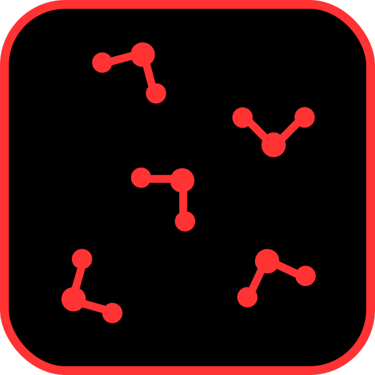

<p align="center">
    
    <br>
    <h1 align="center">
        Simple Force Field
    </h1>
    <h3 align="center">
        A simple, extensible library for defining and working with molecular dynamics force fields in Python.
    </h3>
    <p></p>
    <p align="center">
    <a href="#overview">Overview</a> •
    <a href="#architecture">Architecture</a> •
    <a href="#defining-potentials">Defining Potentials</a> •
    <a href="#defining-force-fields">Defining Force Fields</a> •
    <a href="#api-reference">API Reference</a> •
    <a href="#examples">Examples</a> •
    <a href="#testing">Testing</a>
    </p>
    <p></p>
</p>

## Overview

Force fields are the heart of classical molecular dynamics: they define how atoms interact, which determines all observable properties of the simulated system. Most MD software packages treat force fields as opaque parameter files that get loaded at runtime. This library takes a different approach - it implements force fields as composable Python objects that you can inspect, modify, and extend.

The `force_field` library provides a minimal framework for building force field definitions programmatically. You define atom types (particles with mass, charge, and other properties), potentials (mathematical functions for forces and energies), and interaction types (combinations of atom types and potentials with specific parameters). The library handles:

- Parameter derivation using combination rules (e.g. Lorentz-Berthelot for Lennard‑Jones)
- Automatic loading of physical constants (e.g. Coulomb constant)
- Cutoff behaviour (shifting potentials to zero at a specified distance)
- Validation that all required parameters and constants are present

The result is a force field object that exposes all atom types, interaction types, and their associated methods for calculating forces and energies.

### Design Philosophy

This library prioritises **clarity** and **extensibility** over performance:

- The core abstractions (`AtomType`, `Potential`, `InteractionType`, `ForceField`) are simple Python classes with minimal magic
- You never need to modify files in the `core/` subdirectory; all customisation happens by subclassing or adding new modules
- Potentials are defined by implementing two methods (`F` for force, `U` for energy) - no complex registration systems or decorators
- Force fields are constructed imperatively using `define_atom_type()` and `define_interaction_type()` calls

This makes the library ideal for learning, prototyping, and educational purposes, but it's **not** optimised for production MD simulations with millions of atoms.

<br>

## Architecture

The library is organised into three subdirectories under `force_field/`:

- **`core/`** - The foundational classes that define the force field framework
- **`potentials/`** - Implementations of potential energy functions (Lennard‑Jones, Coulombic, Harmonic, etc.)
- **`examples/`** - Complete force field definitions (mostly three‑site water models)

### Core Module

The `core/` subdirectory contains the base classes:

#### `Potential` (Abstract Base Class)

The base class for all potential energy functions. Any concrete potential must define:

- `name`: A string identifier for the potential (e.g., `'lennard_jones'`)
- `constant_names`: A `frozenset` of physical constants required (e.g., `{'k_e'}` for Coulombic)
- `parameter_names`: A `frozenset` of parameters required (e.g., `{'sigma', 'epsilon'}` for Lennard‑Jones)
- `F(x, *args, **kwargs)`: Static method returning the force at separation `x`
- `U(x, *args, **kwargs)`: Static method returning the potential energy at separation `x`
- `calculate_parameters(atom_types)`: Static method that derives parameters from atom type properties (optional)

The `Potential` class uses a custom metaclass (`PotentialMeta`) that enforces these requirements at class definition time. If you forget to implement a required field or method, you'll get a `TypeError` when Python tries to create the class.

#### `AtomType`

Represents a type of atom (or particle) in the system. Required attributes:

- `name`: Human‑readable name (e.g., `'Oxygen'`)
- `symbol`: Chemical symbol (e.g., `'OW'`)
- `mass`: Atomic mass in AMU

Optional attributes can be passed as keyword arguments and are stored as instance attributes. Common examples include `charge`, `sigma`, and `epsilon` for Lennard‑Jones interactions. You can define arbitrary attributes - the library doesn't enforce a schema.

#### `InteractionType`

Combines atom types, a potential, and specific parameters to define a concrete interaction. When you create an `InteractionType`:

1. The library checks which parameters the potential needs (`potential.parameter_names`)
2. If a parameter is provided explicitly, it uses that value
3. If not, it calls `potential.calculate_parameters(atom_types)` to derive it (e.g. using combination rules)
4. Constants are loaded from the `Constants` class (defined in `constants.py`) unless overridden

The `InteractionType` class exposes two methods for each potential:

- `F_base(x)`: Force without cutoff handling
- `U_base(x)`: Energy without cutoff handling
- `F(x)`: Force with cutoff (returns 0 if `x > cutoff`)
- `U(x)`: Energy with cutoff (shifted so `U(cutoff) = 0`)

#### `DecompositionType`

A frozen dataclass that defines tags for how interactions should be decomposed into Cartesian forces:

- `pairwise`: Non‑bonded interactions between pairs of atoms
- `bond`: Two‑body bonded interactions (stretching)
- `angle`: Three‑body bonded interactions (bending)
- `dihedral`: Four‑body bonded interactions (torsion)

These are purely declarative labels; the MD engine is responsible for interpreting them and computing the actual force vectors.

#### `ForceField`

The top‑level container for a complete force field definition. A `ForceField` manages:

- A list of `AtomType` objects
- A list of `InteractionType` objects
- Uniqueness checks (no duplicate names or symbols)

You build a force field by calling:

- `define_atom_type(name, symbol, mass, **kwargs)` to add atom types
- `define_interaction_type(name, category_name, bonded, potential, decomposition, atom_types, parameters, constants, cutoff)` to add interactions

The `ForceField` class is designed to be subclassed. All the pre‑defined water models inherit from `ForceField` and call `define_atom_type()` and `define_interaction_type()` in their `__init__` methods.

<br>

## Defining Potentials

To add a new potential, create a class that inherits from `Potential` and implements the required fields and methods.

### Example: Lennard‑Jones Potential

Here's the complete implementation from `potentials/lennard_jones.py`:

```python
from dataclasses import dataclass
from ..core import Potential

@dataclass
class LennardJones(Potential):
    name: str = 'lennard_jones'

    constant_names:  frozenset[str] = frozenset()
    parameter_names: frozenset[str] = frozenset(['epsilon', 'sigma'])

    def F(x: float, epsilon: float, sigma: float) -> float:
        return 48 * epsilon * ((sigma**12 / x**13) - 0.5 * (sigma**6 / x**7))

    def U(x: float, epsilon: float, sigma: float) -> float:
        return 4 * epsilon * ((sigma / x)**12 - (sigma / x)**6)

    def calculate_parameters(atom_types):
        # Lorentz-Berthelot combination rules
        epsilon = (atom_types[0].epsilon * atom_types[1].epsilon) ** 0.5
        sigma = (atom_types[0].sigma + atom_types[1].sigma) / 2
        return {'epsilon': epsilon, 'sigma': sigma}
```

**Key points:**

- The `@dataclass` decorator is used for consistency, but it's not strictly required
- `F(x, ...)` returns the force (not the negative gradient - the sign convention is already baked in)
- `U(x, ...)` returns the potential energy
- Both methods are static (no `self` parameter)
- `calculate_parameters` is optional; if omitted, you must provide all parameters explicitly when defining interactions

### Example: Coulombic Potential

The Coulombic potential requires a physical constant (`ecf` - the electric conversion factor). Here's the implementation from `potentials/coulombic.py`:

```python
from dataclasses import dataclass
from ..core import Potential

@dataclass
class Coulombic(Potential):
    name: str = 'coulombic'

    constant_names:  frozenset[str] = frozenset(['ecf', 'epsilon_r'])
    parameter_names: frozenset[str] = frozenset(['charge_product'])

    def F(x: float, charge_product: float, ecf: float, epsilon_r: float) -> float:
        return ecf * charge_product / (epsilon_r * x**2)

    def U(x: float, charge_product: float, ecf: float, epsilon_r: float) -> float:
        return ecf * charge_product / (epsilon_r * x)

    def calculate_parameters(atom_types):
        charge_product = atom_types[0].charge * atom_types[1].charge
        return {'charge_product': charge_product}
```

**Key points:**

- `ecf` and `epsilon_r` are constants, so they appear in `constant_names` but not `parameter_names`
- When you define an interaction using `Coulombic`, the library automatically loads `ecf` and `epsilon_r` from `force_field.constants.Constants`
- The `charge_product` is derived by multiplying the `charge` attributes of the two atom types

### Adding a New Potential to the Library

1. Create a new file in `force_field/potentials/` (e.g. `buckingham.py`)
2. Import `Potential` from `..core`
3. Define your class with all required fields and methods
4. Add the class to `force_field/potentials/__init__.py`:

```python
from .buckingham import Buckingham
```

5. Users can now import it:

```python
from force_field.potentials import Buckingham
```

<br>

## Defining Force Fields

Force fields are defined by subclassing `ForceField` and calling `define_atom_type()` and `define_interaction_type()` in the `__init__` method.

### Example: TIP3P Water Model

Here's a simplified version of the TIP3P implementation from `examples/tip3p.py`:

```python
from ..core import ForceField, DecompositionType
from ..potentials import Harmonic, Coulombic, LennardJones

class TIP3P(ForceField):
    def __init__(self):
        super().__init__()

        self.name = 'TIP3P'
        self.flexible = False

        # Define atom types
        self.define_atom_type(
            name='Oxygen',
            symbol='OW',
            mass=15.9994,
            charge=-0.834,
            sigma=0.31507,
            epsilon=0.63639
        )

        self.define_atom_type(
            name='Hydrogen',
            symbol='HW',
            mass=1.008,
            charge=+0.417
        )

        # Define O-O dispersion (Lennard-Jones)
        self.define_interaction_type(
            name='O-O Dispersion',
            category_name='Dispersion',
            potential=LennardJones,
            decomposition=DecompositionType.pairwise,
            bonded=False,
            atom_types=('OW', 'OW'),
            cutoff=1.0
        )

        # Define O-H electrostatics
        self.define_interaction_type(
            name='O-H Electrostatic',
            category_name='Electrostatic',
            potential=Coulombic,
            decomposition=DecompositionType.pairwise,
            bonded=False,
            atom_types=('OW', 'HW'),
            cutoff=1.0
        )

        # (Additional interactions omitted for brevity)
```

**Key points:**

- Atom types are defined first, interactions second
- `atom_types` can be specified using names or symbols (strings are resolved automatically)
- For Lennard‑Jones, `sigma` and `epsilon` are stored on the oxygen atom type; the library computes the O‑O pair parameters using the Lorentz-Berthelot rules
- For Coulombic, charges are stored on each atom type and extracted automatically
- The `cutoff` parameter is optional; if omitted, the interaction has infinite range

### Adding a New Force Field to the Library

1. Create a new file in `force_field/examples/` (e.g. `amber99.py`)
2. Import `ForceField` from `..core` and the required potentials from `..potentials`
3. Define your class by subclassing `ForceField` and calling `define_atom_type()` and `define_interaction_type()` in `__init__`
4. Add the class to `force_field/examples/__init__.py`:

```python
from .amber99 import AMBER99
```

5. Add it to the top-level `force_field/__init__.py` for convenient importing:

```python
from .examples import AMBER99
```

### Flexible vs. Rigid Models

Some water models (like TIP3P) treat the molecule as rigid, whilst others (like SPC/Fw) allow bond stretching and angle bending. The library doesn't enforce a distinction - you simply define whatever interactions your model needs.

For flexible models, you typically add:

- Bond stretching interactions using a harmonic potential (decomposition: `DecompositionType.bond`)
- Angle bending interactions using a harmonic angular potential (decomposition: `DecompositionType.angle`)

<br>

## API Reference

### `Potential` (Abstract Base Class)

**Location:** `force_field.core.Potential`

#### Class Attributes

- `name: str` - Identifier for the potential
- `constant_names: frozenset[str]` - Physical constants required (e.g., `{'ecf'}`)
- `parameter_names: frozenset[str]` - Parameters required (e.g., `{'sigma', 'epsilon'}`)

#### Methods

##### `F(x: float, *args, **kwargs) -> float` (Static, Abstract)

Calculate the force at separation `x`. Parameters and constants are passed as keyword arguments.

**Returns:** Force in kJ/(mol·nm) (or appropriate units for your system).

##### `U(x: float, *args, **kwargs) -> float` (Static, Abstract)

Calculate the potential energy at separation `x`. Parameters and constants are passed as keyword arguments.

**Returns:** Potential energy in kJ/mol (or appropriate units for your system).

##### `calculate_parameters(atom_types: tuple[AtomType, ...]) -> dict[str, float]` (Static, Optional)

Derive parameters from atom type properties. For example, Lennard‑Jones uses combination rules to compute $\sigma$ and $\epsilon$ for a pair from the individual atom values.

**Returns:** Dictionary mapping parameter names to values.

**Raises:** `NotImplementedError` if the potential does not support automatic parameter calculation.

---

### `AtomType`

**Location:** `force_field.core.AtomType`

#### Constructor

```python
AtomType(name: str, symbol: str, mass: float, **kwargs)
```

**Required Arguments:**

- `name`: Human‑readable name (e.g., `'Oxygen'`)
- `symbol`: Chemical symbol (e.g., `'OW'`)
- `mass`: Atomic mass in AMU

**Optional Keyword Arguments:**

Any additional attributes (e.g., `charge`, `sigma`, `epsilon`) are stored as instance attributes.

#### Attributes

- `name: str`
- `symbol: str`
- `mass: float`
- `interaction_types: list[InteractionType]` - Populated automatically by the `ForceField` when interactions are defined
- Any additional attributes passed via `**kwargs`

---

### `InteractionType`

**Location:** `force_field.core.InteractionType`

#### Constructor

```python
InteractionType(
    name: str,
    category_name: str,
    bonded: bool,
    potential: Potential,
    decomposition: str,
    atom_types: tuple[AtomType, ...],
    parameters: dict[str, float] = None,
    constants: dict[str, float] = None,
    cutoff: float = None
)
```

**Arguments:**

- `name`: Unique identifier for this interaction
- `category_name`: Category label (e.g., `'Dispersion'`, `'Electrostatic'`)
- `bonded`: Whether this is a bonded interaction
- `potential`: The `Potential` class (not an instance)
- `decomposition`: Decomposition type (e.g., `DecompositionType.pairwise`)
- `atom_types`: Tuple of `AtomType` objects involved
- `parameters`: Explicit parameter values (optional; derived if omitted)
- `constants`: Explicit constant values (optional; loaded from `Constants` if omitted)
- `cutoff`: Distance beyond which force and energy are zero (optional)

#### Methods

##### `F_base(x: float) -> float`

Calculate force without cutoff handling.

##### `U_base(x: float) -> float`

Calculate potential energy without cutoff handling.

##### `F(x: float) -> float`

Calculate force with cutoff. If `x > cutoff`, returns `0.0`.

##### `U(x: float) -> float`

Calculate potential energy with cutoff. If `x > cutoff`, returns `0.0`. Otherwise returns `U_base(x) - U_base(cutoff)` (shifted so the energy is continuous and zero at the cutoff).

---

### `DecompositionType`

**Location:** `force_field.core.DecompositionType`

A frozen dataclass with string constants:

- `pairwise = 'pairwise'`
- `bond = 'bond'`
- `angle = 'angle'`
- `dihedral = 'dihedral'`

These are used to tag interaction types with information about how the MD engine should decompose them into Cartesian force vectors.

---

### `ForceField`

**Location:** `force_field.core.ForceField`

#### Constructor

```python
ForceField(name: str = None)
```

**Arguments:**

- `name`: Optional name for the force field

#### Attributes

- `name: str` - Force field name
- `atom_types: list[AtomType]` - All defined atom types
- `atom_type_identifiers: set[str]` - Names and symbols of all atom types (for uniqueness checking)
- `interaction_types: list[InteractionType]` - All defined interactions
- `interaction_type_identifiers: set[str]` - Names of all interactions (for uniqueness checking)

#### Methods

##### `define_atom_type(name: str, symbol: str, mass: float, **kwargs) -> None`

Add a new atom type to the force field.

**Arguments:**

- `name`: Unique human‑readable name
- `symbol`: Unique chemical symbol
- `mass`: Atomic mass in AMU
- `**kwargs`: Additional properties (e.g., `charge`, `sigma`, `epsilon`)

**Raises:** `AssertionError` if the name or symbol is already defined.

##### `get_atom_type(identifier: str) -> AtomType`

Retrieve an atom type by name or symbol.

**Returns:** The matching `AtomType` object.

**Raises:** `ValueError` if the identifier is not found.

##### `define_interaction_type(name: str, category_name: str, bonded: bool, potential: Potential, decomposition: str, atom_types: tuple, parameters: dict = None, constants: dict = None, cutoff: float = None) -> None`

Add a new interaction type to the force field.

**Arguments:**

- `name`: Unique identifier
- `category_name`: Category label
- `bonded`: Whether this is a bonded interaction
- `potential`: The `Potential` class
- `decomposition`: Decomposition type (from `DecompositionType`)
- `atom_types`: Tuple of atom type identifiers (names, symbols, or `AtomType` objects)
- `parameters`: Explicit parameter values (optional)
- `constants`: Explicit constant values (optional)
- `cutoff`: Cutoff distance (optional)

**Raises:** `AssertionError` if the interaction name is already defined, or `ValueError` if atom types cannot be resolved.

---

### `Constants`

**Location:** `force_field.constants.Constants`

A dataclass defining physical constants used by potentials:

- `ecf: float = 138.935458` - Electric conversion factor (kJ mol⁻¹ nm e⁻²)
- `epsilon_r: float = 1.0` - Dielectric constant (unitless)

You can modify or extend this class to add new constants required by custom potentials.

<br>

## Examples

### Using a Pre‑Defined Water Model

```python
from force_field import TIP3P

# Instantiate the force field
ff = TIP3P()

# Print force field name
print(f"Force field: {ff.name}")

# List all atom types
for atom_type in ff.atom_types:
    print(f"Atom: {atom_type.symbol}, Mass: {atom_type.mass} AMU, Charge: {atom_type.charge} e")

# List all interactions and compute forces at 1.0 nm
for interaction in ff.interaction_types:
    F = interaction.F(1.0)
    U = interaction.U(1.0)
    print(f"{interaction.name}: F(1.0 nm) = {F:.3f} kJ/(mol·nm), U(1.0 nm) = {U:.3f} kJ/mol")
```

### Defining a Custom Force Field

```python
from force_field import ForceField, DecompositionType
from force_field.potentials import LennardJones, Coulombic

# Create a new force field
ff = ForceField(name='Simple Argon')

# Define argon atom type
ff.define_atom_type(
    name='Argon',
    symbol='Ar',
    mass=39.948,
    sigma=0.3405,
    epsilon=0.996
)

# Define Ar-Ar Lennard-Jones interaction
ff.define_interaction_type(
    name='Ar-Ar Dispersion',
    category_name='Dispersion',
    bonded=False,
    potential=LennardJones,
    decomposition=DecompositionType.pairwise,
    atom_types=('Ar', 'Ar'),
    cutoff=1.2
)

# Calculate force and energy at various separations
for r in [0.3, 0.4, 0.5, 1.0, 1.5]:
    interaction = ff.interaction_types[0]
    F = interaction.F(r)
    U = interaction.U(r)
    print(f"r = {r:.2f} nm: F = {F:.3f} kJ/(mol·nm), U = {U:.3f} kJ/mol")
```

### Accessing Atom Type Properties

```python
from force_field import TIP3P

ff = TIP3P()

# Get oxygen atom type
oxygen = ff.get_atom_type('OW')

# Access properties
print(f"Mass: {oxygen.mass} AMU")
print(f"Charge: {oxygen.charge} e")
print(f"Sigma: {oxygen.sigma} nm")
print(f"Epsilon: {oxygen.epsilon} kJ/mol")

# List all interactions involving oxygen
for interaction in oxygen.interaction_types:
    print(f"  - {interaction.name}")
```

### Implementing a Custom Potential

```python
import numpy as np
from dataclasses import dataclass

from force_field.core import Potential

@dataclass
class Buckingham(Potential):
    """Buckingham (exp-6) potential: U(r) = A*exp(-B*r) - C/r^6"""

    name: str = 'buckingham'
    constant_names: frozenset[str] = frozenset()
    parameter_names: frozenset[str] = frozenset(['A', 'B', 'C'])

    def F(x: float, A: float, B: float, C: float) -> float:
        """Force = -dU/dr"""
        return A * B * np.exp(-B * x) - 6 * C / x**7

    def U(x: float, A: float, B: float, C: float) -> float:
        """Potential energy"""
        return A * np.exp(-B * x) - C / x**6

    def calculate_parameters(atom_types):
        """Derive parameters from atom type properties"""
        # Example: geometric mean for A and C, arithmetic mean for B
        A = (atom_types[0].A * atom_types[1].A) ** 0.5
        B = (atom_types[0].B + atom_types[1].B) / 2
        C = (atom_types[0].C * atom_types[1].C) ** 0.5
        return {'A': A, 'B': B, 'C': C}
```

<br>

## Testing

The `test/` directory contains several test modules:

### `test_basic.py`

Performs fundamental sanity checks on all force field classes:

- Verifies that all force fields define atom types and interaction types
- Checks that parameters and constants match the potential definitions
- Ensures that force and energy values are finite
- Tests cutoff behaviour (forces and energies vanish beyond the cutoff)
- Verifies that potential energy is continuous at the cutoff distance

**Run with:**

```bash
pytest test/test_basic.py
```

Or directly:

```bash
python test/test_basic.py
```

### `test_potentials.py`

Tests the implementations of specific potentials against analytical expectations and published reference values. For each water model, the test:

1. Computes forces and energies at several representative separations
2. Checks values against literature data or hand‑calculated expectations
3. Verifies correct cutoff behaviour

**Run with:**

```bash
pytest test/test_potentials.py
```

### `plot_potentials.py`

A visualisation script that generates plots of force and energy curves for all implemented water models. This is useful for:

- Visually comparing different models
- Verifying that cutoff behaviour looks correct
- Debugging new potentials or parameter sets

**Run with:**

```bash
python test/plot_potentials.py
```

The script generates a series of matplotlib plots showing $F(r)$ and $U(r)$ curves for each interaction type in each water model.

### Running All Tests

```bash
pytest
```

This runs all test modules and reports pass/fail status for each test case.

<br>

## License

This project is licensed under the [CC BY-NC-SA 4.0 Licence](https://creativecommons.org/licenses/by-nc-sa/4.0/).
You can freely use, modify, and share this work for non-commercial purposes. You must give appropriate credit.
Any modifications must be shared under the same licence. You cannot use this work for commercial purposes without permission.

[](https://creativecommons.org/licenses/by-nc-sa/4.0/)

<br>
